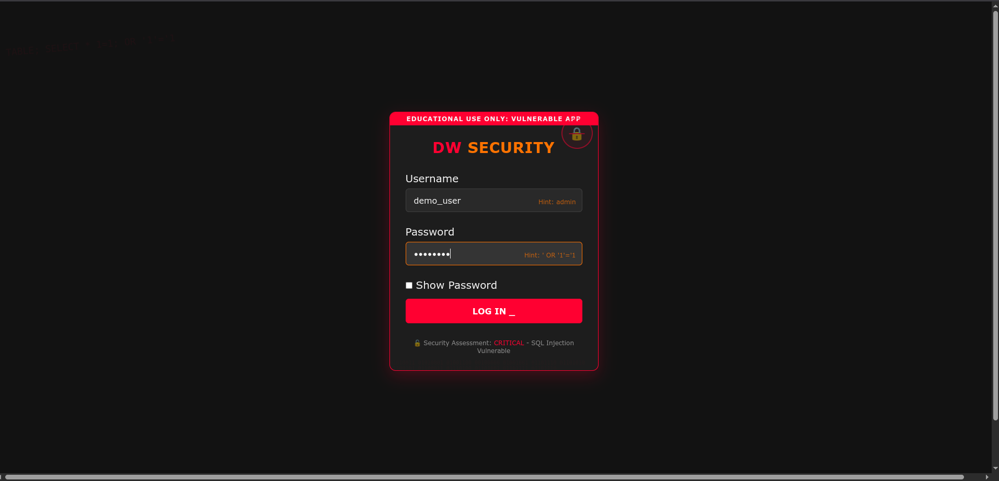
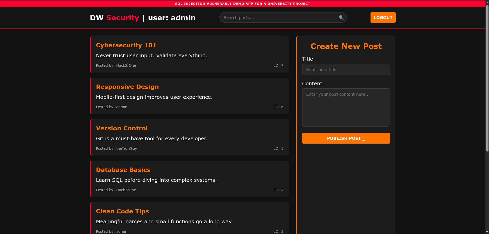

# DWSecurity-SQLi-Lab

A deliberately vulnerable web application designed to demonstrate SQL injection vulnerabilities for educational purposes.

⚠️ **EDUCATIONAL USE ONLY** - This application contains intentional security vulnerabilities.

## Overview

This project was created as part of a university assignment to demonstrate SQL injection vulnerabilities in web applications. It features a simple blog system with user authentication, posting  and search functionality - all vulnerable to SQL injection attacks.

## Project Background

This application was originally created for a university project that required demonstrating SQL injection vulnerabilities. When searching for existing vulnerable web applications to use, I found that most required complex setups with:
- External database servers like MySQL/MariaDB
- Complex configuration steps
- Multiple dependencies or Docker environments

To address this gap, I developed this lightweight alternative that allows for quick setup and immediate demonstration of SQL injection vulnerabilities.

## Why This Project?

DWSecurity-SQLi-Lab addresses the need for a **lightweight** SQL injection demonstration tool that:

- Requires minimal setup (just Node.js - no external database servers)
- Uses an embedded SQLite database for simplicity
- Can be running in under 60 seconds
- Shows both vulnerable code and secure alternatives side-by-side

The focus on simplicity and accessibility makes this tool particularly useful for educational environments, quick classroom demonstrations, or individual learning where minimizing setup time is valuable.

## Features

- Intentionally vulnerable login system
- Blog and vulnerable post creation
- Search functionality vulnerable to SQL injection
- SQLite database (pre-configured)
- JWT authentication with HTTP-only cookies

## Screenshots


- `screenshots/login-screen.png` - Login screen
- `screenshots/blog.png` - Main page

## Installation

### Prerequisites
- Node.js v22.14.0

### Setup
1. Clone the repository:
   ```
   git clone https://github.com/mehdi-zerouak/DWSecurity-SQLi-Lab.git
   cd DWSecurity-SQLi-Lab
   ```

2. Install dependencies:
   ```
   npm install
   ```

3. Start the application:
   ```
   node server.js
   ```

4. Access the application at:
   ```
   http://localhost:3000
   ```

### Default Credentials
- Username: `admin`
- Password: `admin`

## Reset Database

If you need to reset the database to its default state, simply:

1. Open `server.js`
2. Uncomment the `seedDatabase()` function call at the beginning
3. Run the server once to rebuild the database
4. Comment out the line again to prevent recreating the database on future starts (if u don't want data to be reset each time)

## Project Structure

```
├── server.js       # Main application file with routes and controllers
├── database.js     # Database configuration and setup
├── database.db     # SQLite database file
├── views/          # HTML templates
│   ├── login.html  # Login page
│   └── blog.ejs    # Blog page
├── LICENSE         # License file
└── package.json    # Node project configuration
```

## Security Notes

This application intentionally demonstrates insecure coding practices:

- Direct inclusion of user input in SQL queries
- Lack of input sanitization

The code includes commented out examples of secure alternatives (parameterized queries) for educational comparison, but these alternative implementations are not tested and may require adjustments to work properly.

## Demonstration Ideas

1. **Authentication Bypass**: Try using `' OR '1'='1` in the password field
2. **UNION Attacks**: Use the search function with `' UNION SELECT * FROM users --`
3. **Schema Discovery**: Extract table information with `' UNION SELECT sql,null FROM sqlite_master --`

## License

This is free and unencumbered software released into the public domain.

Anyone is free to copy, modify, publish, use, compile, sell, or distribute this software, either in source code form or as a compiled binary, for any purpose, commercial or non-commercial, and by any means.

THE SOFTWARE IS PROVIDED "AS IS", WITHOUT WARRANTY OF ANY KIND.

## Disclaimer

The author's knowledge in security practices is limited. While comments in the code suggest secure alternatives, they are not guaranteed to be complete or error-free. This project should be viewed as a learning tool, not a reference for production security practices.
